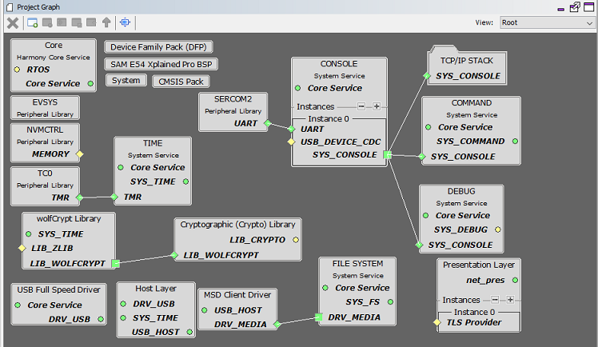
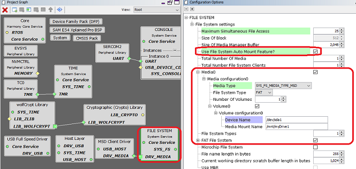
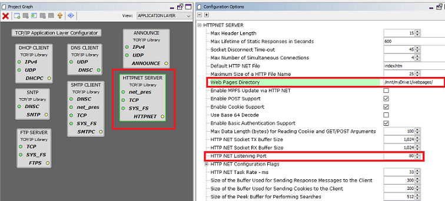
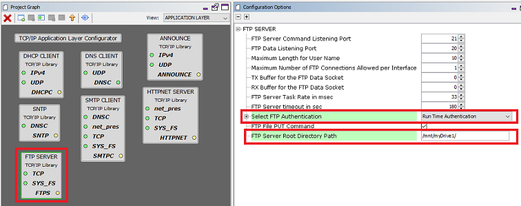

# TCP/IP WEB-NET & FTP Server MHC Configuration

The following Project Graph diagram shows the Harmony components included in the bare-metal TCP/IP Web Server with USB Host_layer , MSD class driver and the MPLAB Harmony File System demonstration application. 

* MHC is launched by selecting **Tools > Embedded > MPLAB® Harmony 3 Configurator** from the MPLAB X IDE and after successful database migration , TCP/IP demo project is ready to be configured and regenerated.

    

* **TCP/IP Root Layer Project Graph**

  The root layer project shows that SERCOM2 peripheral is selected to do read and write operation for TCP/IP commands.

  This is the basic configuration with SYS_CONSOLE, SYS_DEBUG and SYS_COMMAND modules. These modules are required for TCP/IP command execution.

  TCP/IP application with both MPFS and FAT FS access. The below root project graph depicts the use of more than one file syatem mount by TCP/IP stack. Also HTTP Server use Wolfssl library to support secured web server on port. 443

  

  File system component configuration for this application to use USB HOST media –

  

 

* **TCP/IP Required Application**

    TCP/IP demo use these application module components for this demo. **Announce** module to discover the Microchip devices within a local network.

    **DHCP Client** module to discover the IPv4 address from the nearest DHCP Server. **HTTPNET** module is selected to run the web_server for the port number 80.

    **FTP SERVER** an application layer protocol that facilitates uploading of files to, and downloading of files from, an embedded device.     

    

    * HTTPNET server with Web directory Mount path and Security port number configuration:

      

      Http Server module use the NVM mount path with MPFS files system. Also HTTP server module use the non-secured port number **80**.

    * FTP server with Root directory Mount Path and Run time authentication .

      

* **TCPIP Driver Layer**

  **Internal ethernet driver(ethmac)** is enabled with the external **KSZ8091 PHY driver** library. The MIIM Driver supports asynchronous read/write and scan operations for accessing the external PHY registers and notification when MIIM operations have completed.

    
