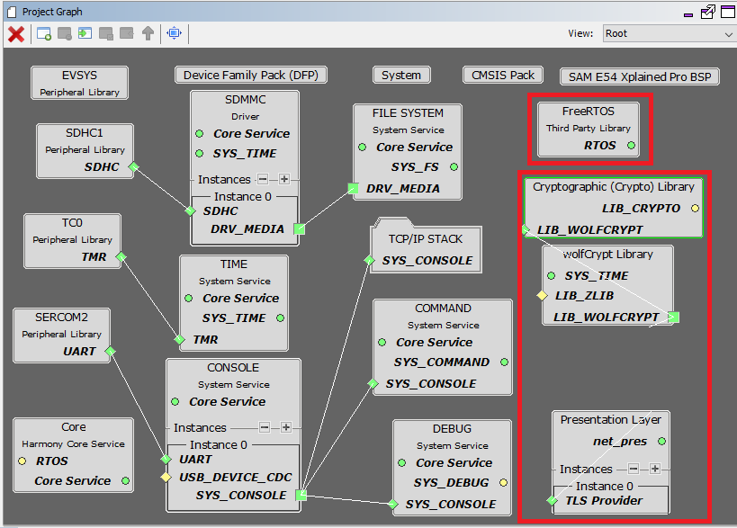
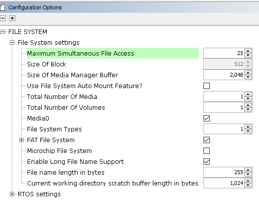
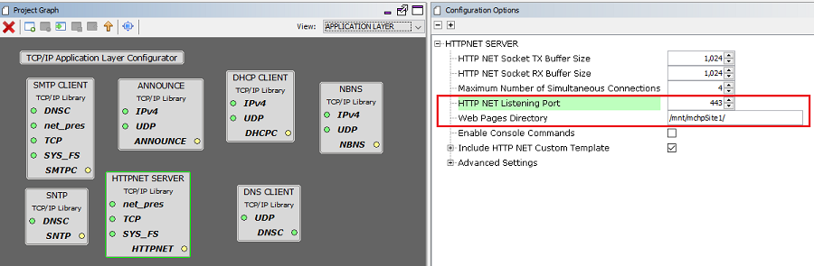

# TCP/IP WEB Server SDCARD Application

The Web Net Server SDCard configuration demonstrates creating an HTTP web server on a Microchip evaluation board. The FAT FS File System is used for storing the web pages on an external SD Card.

This demonstration uses the HTTP\_NET server which supports encrypted communication through the NET\_PRES layer and an external service provider for TLS support.

**TCP/IP Web Server SDMMC FATFS MHC Configuration**

The following Project Graph diagram shows the Harmony components included in the application demonstration.

-   MHC is launched by selecting **Tools \> Embedded \> MPLAB® Harmony 3 Configurator** from the MPLAB X IDE and after successful database migration , TCP/IP demo project is ready to be configured and regenerated.

    

-   **TCP/IP Root Layer Project Graph**

    HSMCI \( High Speed Multimedia Card Interface \) peripheral supports Multimedia card communication. SD multimedia memory card \( SDMMC \) driver provides abstraction to communicate with SD/eMMC card through the HSMCI peripheral library interface. The TCP/IP application use FAT file system with SDMMC driver to read/write to an SD card.

    

    TCP sockets calculate the ISN using the wolfSSL crypto library.

    **Wolfssl crypto** module enabled with MD5,SHA authentication and AES encryption/decryption privacy protocol are enabled. Wolfssl library used a open a secured socket.

    **FreeRTOS** component is required for RTOS application. For bare-metal \(non-RTOS\) **FreeRTOS** component should not be selected.

    The FAT file system is selected for this application to read and write from the SDHC\( sdcard \) module. This is the below snapshot for the FAT FS configuration.

    

-   **TCP/IP Required Application**

    TCP/IP demo use these application module components for this demo.

    **Announce** module to discover the Microchip devices within a local network.

    **DHCP Client** module to discover the IPv4 address from the nearest DHCP Server.

    **HTTP** module is selected to run the web\_server for the port number **80**.

    

-   **TCPIP Driver Layer**

    **Internal ethernet driver\(gmac\)** is enabled with the external **KSZ8091 PHY driver** library for SAME54 demonstartion.

    

    For **SAM V71** demonstration , **LAN8061 PHY driver** ia selcted along with GMAC **Internal ethernet driver**.

    

    The MIIM Driver supports asynchronous read/write and scan operations for accessing the external PHY registers and notification when MIIM operations have completed.

**TCP/IP Web Server SDMMC FATFS Hardware Configuration**

This is the following section describes the hardware configuration used for this application demonstration.

1.  This section describes the required default hardware configuration use USB device as **on board debugger and programmer** for this application demonstration.

    -   No hardware related configuration or jumper setting changes are necessary

    -   Refer to the SAM E54 Ethernet Starter Kit [User Guide](http://ww1.microchip.com/downloads/en/DeviceDoc/70005321A.pdf)

        

    -   Connect the micro USB cable from the computer to the DEBUG USB connector on the SAM E54 Xplained Pro Evaluation Kit

    -   Establish a connection between the router/switch with the SAM E54 Xplained Pro Evaluation Kit through the RJ45 connector

    

**TCP/IP Web Server SDMMC Running Application**

This Web Net Server application uses the SD card as a memory media and reads the web pages stored according to the configured mount path. Web Server reads the external SD card content using FAT FS API.

This table list the name and location of the MPLAB X IDE project folder for the demonstration.

|Project Name|Target Device|Target Development Board|Description|
|------------|-------------|------------------------|-----------|
|sam\_e54\_xpro.X|ATSAME54P20A|ATSAM E54 Xplained pro|Demonstrates the web server SDCARD FAT FS on development board with ATSAME54P20A device and KSZ8091 PHY daughter board. This is a Bare Metal \(non-RTOS\) implementation.|
|sam\_e54\_xpro\_freertos.X|ATSAME54P20A|ATSAM E54 Xplained pro|Demonstrates the web server SDCARD FAT FS on development board with ATSAME54P20A device and KSZ8091 PHY daughter board. This is a FreeRTOS implementation.|

1.  Ensure a microSD/SD card is formatted and loaded with the web pages provided within the < install-dir \>/net/apps/web\_net\_server\_sdcard\_fatfs/firmware/src/web\_pages directory.

**Running Demonstration Steps**

1.  Build and download the demonstration project on the target board.

2.  If the board has a SERCOM configuration:

    1.  A virtual COM port will be detected on the computer, when the USB cable is connected to USB-UART connector.

    2.  Open a standard terminal application on the computer \(like Hyper-terminal or Tera Term\) and configure the virtual COM port.

    3.  Set the serial baud rate to 115200 baud in the terminal application.

    4.  See that the initialization prints on the serial port terminal.

    5.  When the DHCP client is enabled in the demonstration, wait for the DHCP server to assign an IP address for the development board. This will be printed on the serial port terminal.

        -   Alternatively: Use the Announce service or ping to get the IP address of the board.

        -   Run **tcpip\_discoverer.jar** to discover the IPv4 and IPv6 address for the board.

3.  HTTP Server Output -

    An HTTP server is hosted by the demonstration application. Open\_a web browser and direct it to the board running the HTTP server by typing the URL in the address bar \(for example, https://mchpboard\_c\), and then pressing Enter.

    The demonstration application features following:

    Real-time Hardware Control and Dynamic Variables - On the Overview page the LEDs can be clicked to toggle the LEDs on the Microchip hardware development board. The SWITCHes on the Microchip hardware development board can be pressed to toggle the Buttons on the web page. The dynamic variables can be updated in real-time on the HTTP server.

    **Note:** For the LED and SWITCH functionality portion of the demonstration, configure the GPIOs connected to LEDs and Switches on Microchip hardware development board, through the Pin Configuration manager in MPLAB® Harmony Configurator \(MHC\).

    1.  **Form Processing** - Input can be handled from the client by using the GET and POST methods \(this functionality controls the on-board LEDs and is operational only on the Explorer 16 Development Board\)

    2.  **Authentication** - Shows an example of the commonly used restricted access feature

    3.  **Cookies** - Shows an example of storing small text strings on the client side

    4.  **File Uploads** - Shows an example of a file upload using the POST method. The HTTP server can\_accept\_a user-defined MPFS/MPFS2 image file for web pages.

    5.  **Send E-mail** - Shows simple SMTP POST methods

    6.  **Dynamic DNS** - Exercises Dynamic DNS capabilities

    7.  **Network Configuration** - The MAC address, host name, and IP address of the evaluation kit can be viewed in the Network Configuration page and some configurations can be updated

    8.  **MPFS Upload** - A new set of web pages can be uploaded to the web server using this feature, which is accessed through http://mchpboard\_c/mpfsupload

        

**Parent topic:**[MPLAB® Harmony 3 TCP/IP Application for SAM E5X Family](../../docs/GUID-30573197-7C83-4B97-BBF2-7CA462FAE748.md)

