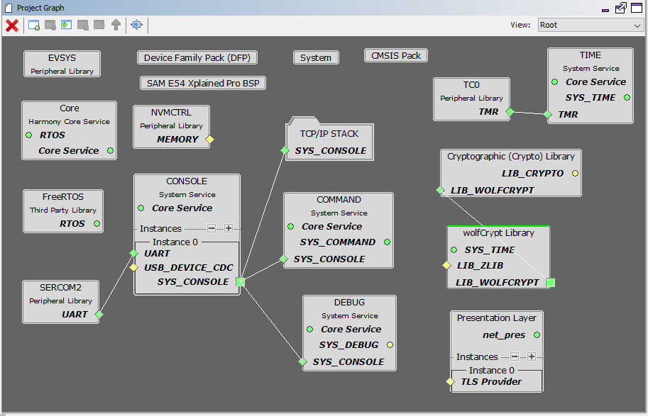
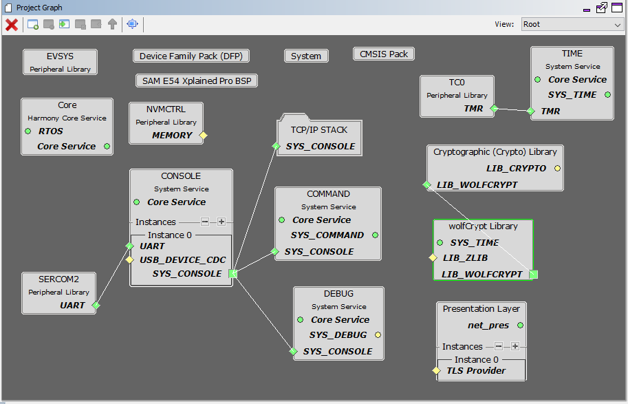
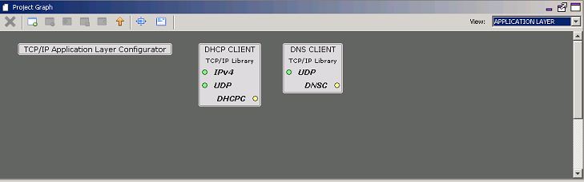
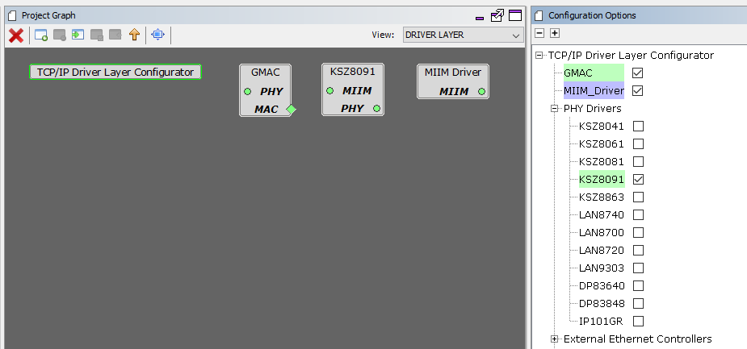
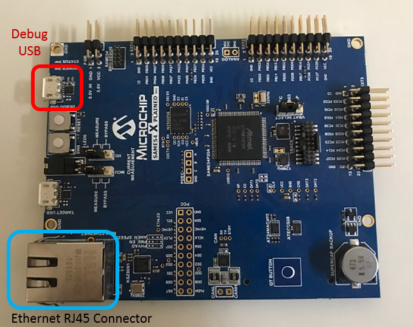
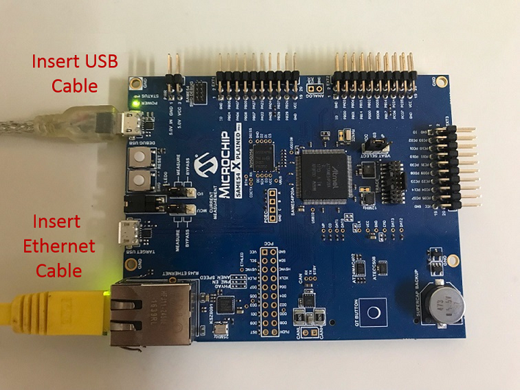

# TCP/IP TCP and UDP Client Server

The TCP Client Server configuration demonstrates creating a network client and a network server that uses the MPLAB Harmony TCP API. This demonstration is a combination of the TCP/IP Client and TCP/IP Server application for both TCP and UDP sockets.

**TCP/IP TCP and UDP Client Server MHC Configuration**

The following Project Graph diagram shows the Harmony components included in the TCP Client demonstration application.

-   MHC is launched by selecting **Tools \> Embedded \> MPLAB® Harmony 3 Configurator** from the MPLAB X IDE and after successful database migration , TCP/IP demo project is ready to be configured and regenerated.

    

-   **TCP/IP Root Layer Project Graph**

    The root layer project shows that SERCOM2 peripheral is selected to do read and write operation for TCP/IP commands.

    This is the basic configuration with SYS\_CONSOLE, SYS\_DEBUG and SYS\_COMMAND modules. These modules are required for TCP/IP command execution.

    

    **FreeRTOS** component is required for RTOS application. For bare-metal \(non-RTOS\) **FreeRTOS** component should not be selected.

    **NOTE** - The above diagram contains **FreeRTOS** component and that is required for RTOS application. For bare-metal\(non-RTOS\) **FreeRTOS** component shouldn't be selected.

    

    TCP sockets calculate the ISN using the wolfSSL crypto library.

-   **TCP/IP Required Application**

    TCP/IP demo use these application module components for this demo. **Announce** module to discover the Microchip devices within a local network.

    **DHCP Client** module to discover the IPv4 address from the nearest DHCP Server.

    **DNS Client** provides DNS resolution capabilities to the stack.

    **Berkeley API** module provides the Berkeley\_Socket\_Distribution \(BSD\) wrapper to the native Microchip TCP/IP Stack APIs. During this component selection, the required transport and network modules are also selected.

    

-   **TCPIP Driver Layer**

    **Internal ethernet driver\(gmac\)** is enabled with the external **KSZ8091 PHY driver** library for SAME54 demonstartion.

    

    The MIIM Driver supports asynchronous read/write and scan operations for accessing the external PHY registers and notification when MIIM operations have completed.

**TCP/IP TCP and UDP Client Server Hardware Configuration**

This is the following section describes the hardware configuration used for this application demonstration.

1.  This section describes the required default hardware configuration use USB device as **on board debugger and programmer** for this application demonstration.

    -   No hardware related configuration or jumper setting changes are necessary

    -   Refer to the SAM E54 Ethernet Starter Kit [User Guide](http://ww1.microchip.com/downloads/en/DeviceDoc/70005321A.pdf)

        

    -   Connect the micro USB cable from the computer to the DEBUG USB connector on the SAM E54 Xplained Pro Evaluation Kit

    -   Establish a connection between the router/switch with the SAM E54 Xplained Pro Evaluation Kit through the RJ45 connector

    

**TCP/IP TCP and UDP Client Server Running Application**

The Client Server configuration use combination of both TCP and UDP sockets for both client and server communication.

This table list the name and location of the MPLAB X IDE project folder for the demonstration.

|Project Name|Target Device|Target Development Board|Description|
|------------|-------------|------------------------|-----------|

\|sam\_e54\_xpro\_freertos.X \| ATSAME54P20A \| ATSAM E54 Xplained pro \| Demonstrates the TCP/IP TCP Client Server on development board with ATSAME54P20A device and KSZ8091 PHY daughter board. This implementation is based on FreeRTOS. \|

**Running Demonstration Steps**

1.  Build and download the demonstration project on the target board.

2.  If the board has a SERCOM configuration:

    1.  A virtual COM port will be detected on the computer, when the USB cable is connected to USB-UART connector.

    2.  Open a standard terminal application on the computer \(like Hyper-terminal or Tera Term\) and configure the virtual COM port.

    3.  Set the serial baud rate to 115200 baud in the terminal application.

    4.  See that the initialization prints on the serial port terminal.

    5.  When the DHCP client is enabled in the demonstration, wait for the DHCP server to assign an IP address for the development board. This will be printed on the serial port terminal.

        -   Alternatively: Use the Announce service or ping to get the IP address of the board.

        -   Run **tcpip\_discoverer.jar** to discover the IPv4 and IPv6 address for the board.

3.  Execution :

    1.  Once the demonstration starts executing, we can observe the current IP settings at the Tera Term terminal port.

    2.  Using "help" will display the available commands that can be used for this demo.

    3.  The application can create 4 separate connections, each one running in its own thread:

        -   A TCP client connection

        -   A TCP server connection

        -   A UDP client connection

        -   A UDP server connection

    4.  Each connection has its own set of commands.

        -   They can open or close the sockets, send messages to the socket they are connected to, they can display the received messages, etc.

        -   Using your preferred networking tools on the PC side \( netcat, Packet Sender, Hercules, python scripts, etc., etc. \) create sockets that talk to the ones opened by the client server application.

        -   This way you can exchange data with any/all of the communication threads that the demonstration creates.

    5.  After the successful broad bring up, the console output becomes

        

    6.  For TCP Client test, input the following command from the serial port: **openurl < url \>** - The < url \> argument must be a fully formed URL; for instance, http://www.microchip.com/.

        For this above URL , the DNS module will make a DNS query. Then it will open a connection to the requested URL and perform a simple HTTP GET command. The response received from the server will be printed on the terminal application through the serial port.

        The expected output -

        

    7.  For TCP Server test, the TCP Client application is required to run on the computer \(SocketTest, Packet Sender etc\). In this demonstration, we use the program, SocketTest \(http://sockettest.sourceforge.net/\). This demonstration is tested with **SocketTest v3.0**.

        -   Open the **SocketTest** software and set the configuration as shown in the following figure.

            

        -   Press the Connect button on the **SocketTest** software after setting the configuration. The serial terminal indicates that the connection has been established.

        -   Type any message in the message box of the **SocketTest** program, and press the Send button. The Server running on the development board will echo back the message to the **SocketTest** program.

            

    8.  Simillarly UDP Client and Server test also performed using **SocketTest** tool.

**Parent topic:**[MPLAB® Harmony 3 TCP/IP Application for SAM E5X Family](GUID-30573197-7C83-4B97-BBF2-7CA462FAE748.md)

