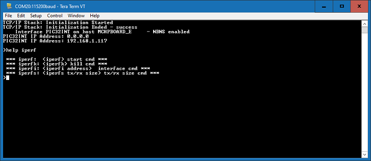

# TCP/IP Iperf Application

Iperf is a standard networking tool that helps to measure networking bandwidth and performance.

The iperf demo creates an application that can be used for running iperf and measuring the network performance.

**TCP/IP IPERF Application MHC Configuration**

The following Project Graph diagram shows the Harmony components included in the TCP Client demonstration application.

-   MHC is launched by selecting **Tools \> Embedded \> MPLAB® Harmony 3 Configurator** from the MPLAB X IDE and after successful database migration , TCP/IP demo project is ready to be configured and regenerated.

    

-   **TCP/IP Root Layer Project Graph**

    The root layer project shows that SERCOM2 peripheral is selected to do read and write operation for TCP/IP commands.

    This is the basic configuration with SYS\_CONSOLE, SYS\_DEBUG and SYS\_COMMAND modules. These modules are required for TCP/IP command execution.

    

    **FreeRTOS** component is required for RTOS application. For bare-metal \(non-RTOS\) **FreeRTOS** component should not be selected.

    **NOTE** - The above diagram contains **FreeRTOS** component and that is required for RTOS application. For bare-metal\(non-RTOS\) **FreeRTOS** component shouldn't be selected.

    

-   **TCP/IP Required Application**

    TCP/IP demo use these application module components for this demo.

    **Announce** module to discover the Microchip devices within a local network.

    **DHCP Client** module to discover the IPv4 address from the nearest DHCP Server.

    **IPERF** module is used to run the network benchmark program.

    The default sizes of the Iperf RX and TX buffers are set to 4KB. The performance of a socket is highly dependent on the size of its buffers. So it's a good idea to use as large as possible buffers for the sockets that need high throughput. Bigger buffers will help obtain higher performance numbers.

    The other iperf parameters could be left with their default values.

    For a description of the parameters see the **Iperf Module** of the TCIP Library document.

    

-   **TCPIP Driver Layer**

    **Internal ethernet driver\(gmac\)** is enabled with the external **KSZ8091 PHY driver** library for SAME54 demonstartion.

    

    For **SAM V71** demonstration , **LAN8061 PHY driver** ia selcted along with GMAC **Internal ethernet driver**.

    

    The MIIM Driver supports asynchronous read/write and scan operations for accessing the external PHY registers and notification when MIIM operations have completed.

**TCP/IP IPERF Application Hardware Configuration**

This is the following section describes the hardware configuration used for this application demonstration.

1.  This section describes the required default hardware configuration use USB device as **on board debugger and programmer** for this application demonstration.

    -   No hardware related configuration or jumper setting changes are necessary

    -   Refer to the SAM E54 Ethernet Starter Kit [User Guide](http://ww1.microchip.com/downloads/en/DeviceDoc/70005321A.pdf)

        

    -   Connect the micro USB cable from the computer to the DEBUG USB connector on the SAM E54 Xplained Pro Evaluation Kit

    -   Establish a connection between the router/switch with the SAM E54 Xplained Pro Evaluation Kit through the RJ45 connector

    

**TCP/IP IPERF Running Application**

This table list the name and location of the MPLAB X IDE project folder for the demonstration.

|Project Name|Target Device|Target Development Board|Description|
|------------|-------------|------------------------|-----------|
|sam\_e54\_xpro.X|ATSAME54P20A|ATSAM E54 Xplained pro|Demonstrates the IPERF application on development board with ATSAME54P20A device and KSZ8091 PHY daughter board. This implementation is based on Bare Metal \( non-RTOS\).|
|sam\_e54\_xpro\_freertos.X|ATSAME54P20A|ATSAM E54 Xplained pro|Demonstrates the IPERF application on development board with ATSAME54P20A device and KSZ8091 PHY daughter board. This implementation is based on Freertos.|

**Running Demonstration Steps**

1.  Build and download the demonstration project on the target board.

2.  If the board has a SERCOM configuration:

    1.  A virtual COM port will be detected on the computer, when the USB cable is connected to USB-UART connector.

    2.  Open a standard terminal application on the computer \(like Hyper-terminal or Tera Term\) and configure the virtual COM port.

    3.  Set the serial baud rate to 115200 baud in the terminal application.

    4.  See that the initialization prints on the serial port terminal.

    5.  When the DHCP client is enabled in the demonstration, wait for the DHCP server to assign an IP address for the development board. This will be printed on the serial port terminal.

        -   Alternatively: Use the Announce service or ping to get the IP address of the board.

        -   Run **tcpip\_discoverer.jar** to discover the IPv4 and IPv6 address for the board.

3.  Execution :

    -   The iperf demo is interactive, using a set of special iperf commands that are supported by the standard set of TCP/IP commands.

    -   Pressing "help iperf" at the command prompt displays the list of the available iperf commands/options:

        

    A brief description of the most important settings/commands follows:

    -   "iperf": starts the iperf session. Use "iperf -s" for a server connection or "iperf -c address" for a client connection

        -   Look at the Iperf Module for examples of iperf benchmarks

    -   "iperfk" kills an ongoing iperf test. This is mainly useful for killing a iperf server waiting for connections. But the command could be also used to abort client test.

    -   "iperfi -a address" allows to set the interface to use for iperf when the test is run on a multi-interface host. When multiple iperf instabces are used, the extra parameter "-i" could be used to specify the iperf index to which the command refers to.

    -   "iperfs" command could be used to set the socket TX or RX buffer size dynamically. For example:

        -   "iperfs -tx 2048"

    **Note:**

    -   The iperf demo uses very few TCP/IP modules, to minimize the stack overhead and to obtain good throughput numbers.

        -   However ICMP server, NBNS and Announce modules are enabled to assist in the discovery of the board on the network.

        -   DHCP client is also enabled for acquiring a valid IP address within the network.

        -   Some of these modules could be further disabled if they are not used in the specific network environment of the application.

    -   The data throughput could vary dependent on the iperf socket settings and the network conditions.

        -   Larger TX and RX buffers will increase the corresponding throughput.

        -   Various devices on the network on the link between the board and the machine running the iperf application \(switches, routers, etc.\) could also affect the throughput.

        -   User can eliminate these effects by connecting the board running the iperf demo directly to the machine running the test on the PC side \(Linux, Windows, etc.\)

**Parent topic:**[MPLAB® Harmony 3 TCP/IP Application for SAM E5X Family](GUID-30573197-7C83-4B97-BBF2-7CA462FAE748.md)

