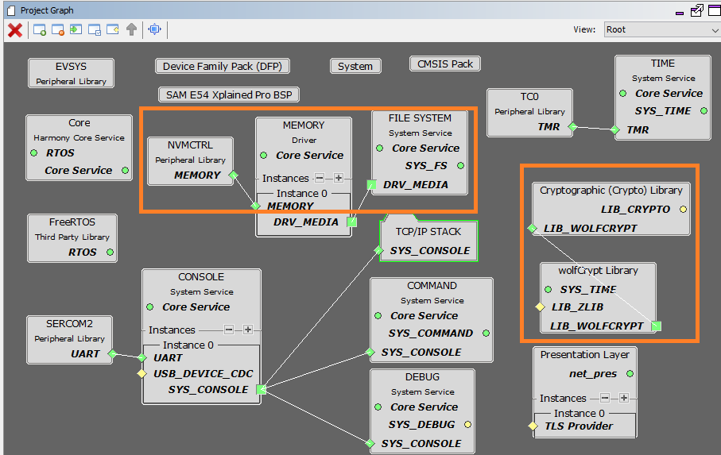
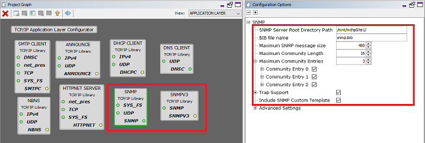

# TCP/IP Iperf Application

The Microchip SNMP Server is a multi-lingual implementation, which supports SNMPv1, V2c, and V3 server features simultaneously. The SNMP Server is implemented to address the requirements of embedded applications and works with both IPv4 and IPv6 addresses.

**TCP/IP SNMP NVM MPFS MHC Configuration**

The following Project Graph diagram shows the Harmony components included in the application demonstration.

-   MHC is launched by selecting **Tools \> Embedded \> MPLAB® Harmony 3 Configurator** from the MPLAB X IDE and after successful database migration , TCP/IP demo project is ready to be configured and regenerated.

    

-   **TCP/IP Root Layer Project Graph**

    The root layer project shows that SERCOM2 peripheral is selected to do read and write operation for TCP/IP commands.

    This is the basic configuration with SYS\_CONSOLE, SYS\_DEBUG and SYS\_COMMAND modules. These modules are required for TCP/IP command execution.

    

    The file system component is required to select MPFS module. This is the below snapshot for the FS configuration.

    **FreeRTOS** component is required for RTOS application. For bare-metal \(non-RTOS\) **FreeRTOS** component should not be selected.

    

-   **TCP/IP Required Application**

    TCP/IP demo use these application module components for this demo.

    **Announce** module to discover the Microchip devices within a local network.

    **DHCP Client** module to discover the IPv4 address from the nearest DHCP Server.

    **HTTPNET** module is selected to run the web\_server for the port number **80**.

    **SNMP** and **SNMPv3** are an application layer protocols that facilitates the exchange of management information among network devices.

    

    **Maximum SNMP Message Size** can be increased and the value should be multiple of 32 bytes for larger GET-Bulk response.

-   **TCPIP Driver Layer**

    **Internal ethernet driver\(gmac\)** is enabled with the external **KSZ8091 PHY driver** library for SAME54 demonstartion.

    

    The MIIM Driver supports asynchronous read/write and scan operations for accessing the external PHY registers and notification when MIIM operations have completed.

**TCP/IP SNMP NVM MPFS Hardware Configuration**

This is the following section describes the hardware configuration used for this application demonstration.

1.  This section describes the required default hardware configuration use USB device as **on board debugger and programmer** for this application demonstration.

    -   No hardware related configuration or jumper setting changes are necessary

    -   Refer to the SAM E54 Ethernet Starter Kit [User Guide](http://ww1.microchip.com/downloads/en/DeviceDoc/70005321A.pdf)

        

    -   Connect the micro USB cable from the computer to the DEBUG USB connector on the SAM E54 Xplained Pro Evaluation Kit

    -   Establish a connection between the router/switch with the SAM E54 Xplained Pro Evaluation Kit through the RJ45 connector

    

**TCP/IP SNMP NVM MPFS Running Application**

The Non-Volatile Memory \(NVM\) Microchip Proprietary File System \(MPFS\) has the **snmp.bib** file along with other web page files stored in internal Flash and are accessed through the MPFS API.

This table list the name and location of the MPLAB X IDE project folder for the demonstration.

|Project Name|Target Device|Target Development Board|Description|
|------------|-------------|------------------------|-----------|
|sam\_e54\_xpro.X|ATSAME54P20A|ATSAM E54 Xplained pro|Demonstrates the SNMP application on development board with ATSAME54P20A device and KSZ8091 PHY daughter board. This implementation is based on Bare Metal \( non-RTOS\).|
|sam\_e54\_xpro\_freertos.X|ATSAME54P20A|ATSAM E54 Xplained pro|Demonstrates the SNMP application on development board with ATSAME54P20A device and KSZ8091 PHY daughter board. This implementation is based on Freertos.|

**Running Demonstration Steps**

1.  Build and download the demonstration project on the target board.

2.  If the board has a SERCOM configuration:

    1.  A virtual COM port will be detected on the computer, when the USB cable is connected to USB-UART connector.

    2.  Open a standard terminal application on the computer \(like Hyper-terminal or Tera Term\) and configure the virtual COM port.

    3.  Set the serial baud rate to 115200 baud in the terminal application.

    4.  See that the initialization prints on the serial port terminal.

    5.  When the DHCP client is enabled in the demonstration, wait for the DHCP server to assign an IP address for the development board. This will be printed on the serial port terminal.

        -   Alternatively: Use the Announce service or ping to get the IP address of the board.

        -   Run **tcpip\_discoverer.jar** to discover the IPv4 and IPv6 address for the board.

3.  Execution :

    1.  The SNMP and SNMPv3 server is hosted by the application.

    2.  Open a SNMP manager \(iREASONING SNMP manager is recommended\) and Follow the steps given in **iREASONING Networks MIB Browser section** in the Third-Party help for complete details on using and configuring the application demonstration using the iREASONING SNMP Manager.

    3.  SNMP MIB Browser -

        -   Several SNMP MIB browsers are available. Users can also install a customized MIB browser specific to their application.

        -   Verify SNMP Get, GetNext, GetBulk, Set requests and Get response operations .

        -   For SNMP v2c , the Agent is configured with three Read communities \("public", "read", " "\) and three Write communities \("private","write","public"\).

            |community Index|Read|Write|
            |---------------|----|-----|
            |1|public|private|
            |2|read|write|
            |3|-----|public|

        -   For SNMP v3, the Agent is configured as per the following table:

            |Type|USER 1|USER 2|USER 3|
            |----|------|------|------|
            |USM User|microchip|SnmpAdmin|root|
            |Security Level|auth, priv|auth, no priv|no auth, no priv|
            |Auth Algorithm|MD5|SHA1|N/A|
            |Auth Password|auth12345|ChandlerUS|N/A|
            |Privacy Algorithm|AES|N/A|N/A|
            |Privacy Password|priv12345|N/A|N/A|

            The Microchip SNMP Stack supports both TRAP version 1 and TRAP version 2. The default trap output is a multi-varbind SNMPv3 TRAP version 2. Trap receiver setting of iReasoning to be selected and configured to visualize the trap output in the iReasoning MIB browser.

**Parent topic:**[MPLAB® Harmony 3 TCP/IP Application for SAM E5X Family](GUID-30573197-7C83-4B97-BBF2-7CA462FAE748.md)

